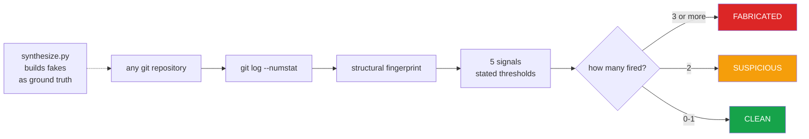

<h1 align="center">commit-history-forensics (Python · Git · timestamp forensics)</h1>
<p align="center"><i>Does this commit history describe work that happened?</i></p>

<p align="center">
  <a href="docs/RESULTS.md">Results</a> &middot;
  <a href="docs/SIGNALS.md">The signals</a> &middot;
  <a href="docs/PROBLEMS.md">Problems hit</a> &middot;
  <a href="docs/LIMITATIONS.md">Limitations</a> &middot;
  <a href="docs/FUTURE.md">Future work</a> &middot;
  <a href="#run-it">Run it</a>
</p>

<p align="center">
  <a href="https://github.com/hammasbuilds/commit-history-forensics/actions/workflows/ci.yml"></a>
  <a href="LICENSE"></a>
  
  
  
  
  <a href="https://github.com/astral-sh/ruff"></a>
</p>

---

> ### 25/25 genuine repositories clean. 2/2 fabrications caught - including one that hides the timestamp tell.

Contribution-graph generators produce a year of green squares in minutes. This measures how
well they hide, using only **structural** properties of the history - timestamps,
uniformity, cadence - so the verdict holds regardless of what the code contains.

Nothing is trained. Every threshold sits in `src/score.py` beside its reasoning, so you can
disagree with a number rather than with a black box.

---

## The result

| | Repos | Verdict |
|---|---:|---|
| Genuine histories | **25** | **25 CLEAN** - zero false positives |
| Fabricated, naive | 1 | **FABRICATED** (4/5 signals) |
| Fabricated, committer date concealed | 1 | **FABRICATED** (3/5 signals) |

**The second fabrication is the one that matters.** Setting `GIT_COMMITTER_DATE` defeats
the timestamp signal completely - and it is still caught, because it edits exactly one file
in every commit and real work does not.

| Repository | median author&rarr;committer gap | files per commit |
|---|---:|---:|
| `fake_naive` | **37 days** | **1.00** |
| `fake_hidden` | 0 days | **1.00** |
| control (genuine) | 0 days | 3.2 |
| 24 real repositories | 0 days | 1.0 - 95.6 |

&#128202; **[Full results and the fingerprint of every repository &rarr;](docs/RESULTS.md)**

---

## How it works



&#128269; **[What each signal measures, and what defeats it &rarr;](docs/SIGNALS.md)**

---

## Why the detector and not the generator

This started from evaluating a contribution-graph generator. Using one is a bad trade: it
fabricates history, it is detectable by everything here, and **a single fabricated repo
makes a reviewer re-read all the genuine ones with suspicion.**

The interesting half - and the defensible one to publish - is measuring how visible the
fabrication is.

`src/synthesize.py` exists **only** to produce ground truth. It writes to a temporary
directory and pushes nowhere.

---

## Run it

```bash
python src/features.py   <folder-of-repos>   # raw fingerprints
python src/score.py      <folder-of-repos>   # verdicts
python src/synthesize.py <output-folder>     # build fakes to test against
pytest -q                                    # 13 tests
```

It reads `git log` live, so verdicts describe repositories as they are now.

**The tests build real git repositories** in `tmp_path` with real commits - no mocks, no
committed fixtures - so behaviour is checked against real git objects.

---

## Input

A folder of git repositories. Here, two fabricated histories and one honest control,
all built by `synthesize.py` so the ground truth is known.


## Output


*`fake_hidden` forges the committer date too, so `backdated_commits` never fires — it is
caught by `single_file_every_commit` instead. The honest control draws zero flags.*

---

## An honest limitation, asserted in the tests

An adversary who **both** conceals the committer date **and** keeps the history short
(under ~60 days, few commits per day) defeats three of five signals and reaches only
`SUSPICIOUS`.

`test_short_hidden_fake_is_only_suspicious` asserts exactly that, so the limitation cannot
quietly disappear or quietly get worse.

&#9888; **[Every limitation, including how weak the 25/25 really is &rarr;](docs/LIMITATIONS.md)**

---

## Also worth reading

| | |
|---|---|
| &#128202; **[Results](docs/RESULTS.md)** | Every repository's fingerprint and verdict |
| &#128269; **[The signals](docs/SIGNALS.md)** | Each threshold, its reasoning, and what defeats it |
| &#128736; **[Problems hit](docs/PROBLEMS.md)** | Empty-repo crash, a fixture that hid a real weakness |
| &#9888; **[Limitations](docs/LIMITATIONS.md)** | Why 25/25 is weaker evidence than it looks |
| &#128640; **[Future work](docs/FUTURE.md)** | Larger corpus, multi-author signals, calibrated scoring |

---

## Layout

```
src/features.py     structural fingerprint of a history, from git log
src/score.py        five signals with stated thresholds, and the verdict
src/synthesize.py   generate fabricated histories (ground truth only)
tests/              13 tests that build real git repositories
docs/               detailed documentation
```

## Stack

`Python 3.11+` &middot; `git` &middot; `pandas`
&middot; `pytest` &middot; `ruff` &middot; `GitHub Actions` - the detector itself uses the
**standard library only**

## Keywords

git forensics &middot; commit history analysis &middot; fake GitHub contributions &middot;
contribution graph &middot; fabricated commits &middot; backdated commits &middot;
GIT_COMMITTER_DATE &middot; git metadata analysis &middot; developer analytics &middot;
repository mining &middot; MSR &middot; fraud detection &middot; anomaly detection &middot;
software engineering research &middot; resume verification &middot; open source integrity

## Licence

MIT - see [LICENSE](LICENSE).
