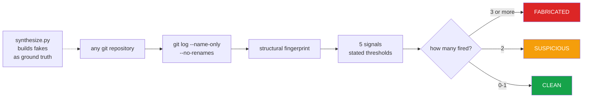

<h1 align="center">commit-history-forensics (Python · Git · timestamp forensics)</h1>
<p align="center"><i>Does this commit history describe work that happened?</i></p>

<p align="center">
  <a href="docs/RESULTS.md">Results</a> &middot;
  <a href="docs/SIGNALS.md">The signals</a> &middot;
  <a href="docs/PROBLEMS.md">Problems hit</a> &middot;
  <a href="docs/LIMITATIONS.md">Limitations</a> &middot;
  <a href="docs/FUTURE.md">Future work</a> &middot;
  <a href="#run-it">Run it</a>
</p>

<p align="center">
  <a href="https://github.com/hammasbuilds/commit-history-forensics/actions/workflows/ci.yml"></a>
  <a href="LICENSE"></a>
  
  
  
  
  
  <a href="https://github.com/astral-sh/ruff"></a>
</p>

---

> ### 86 genuine repositories and 178,101 real commits: zero false positives. 12 of 16 fabrications caught - and the 4 that got away are the interesting part.

Contribution-graph generators produce a year of green squares in minutes. This measures how
well they hide, using only **structural** properties of the history - timestamps,
uniformity, cadence - so the verdict holds regardless of what the code contains.

Nothing is trained. Every threshold sits in `src/score.py` beside its reasoning, so you can
disagree with a number rather than with a black box.

---

## The result

### One adversary per signal

Scoring a detector against a single forgery it already knows will always look perfect. The
earlier version of this page reported **2/2 fabrications caught**, and both came from the
same generator - the second differed from the first only in setting `GIT_COMMITTER_DATE`.
That is one trick, counted twice.

So `src/adversaries.py` builds one fabrication per signal, each written to defeat a
specific one, plus a combination of all of them. Two seeds each, ~250-390 commits apiece.
The useful column is the last one.

| Adversary | What it hides | Verdict | Flags |
|---|---|---|---:|
| `naive` | nothing - the baseline forgery | **FABRICATED** | 4 |
| `hidden_skew` | sets the committer date too | **FABRICATED** | 3 |
| `varied_messages` | writes real-looking subjects | SUSPICIOUS | 2 |
| `human_hours` | commits in working hours only | SUSPICIOUS | 2 |
| `bursty` | clusters work, then rests | SUSPICIOUS | 2 |
| `varied_files` | touches several files per commit | ONE FLAG | 1 |
| `full_stealth` | all of the above at once | **CLEAN** | **0** |
| `backfilled` | all of the above, then real work on top | **CLEAN** | **0** |

**12 of 16 fabrications flagged at some level. 4 were invisible.** Only the two laziest
reach `FABRICATED`. An adversary who conceals the committer date, varies files and
messages, commits during working hours and works in bursts defeats this detector
completely - and so does one who simply prepends a fake year to a genuine repository.

**`varied_files` is the cheapest evasion.** It scores *lower* than adversaries that hide
more, because `templated_messages` only fires when `subject_unique_share > 0.98` **and**
`files_always_one`. Varying the files touched defeats two signals with one change, and the
messages can stay perfectly templated. A conjunction makes a signal precise and it also
makes it cheap to evade. `tests/test_forensics.py` asserts this so it cannot regress
quietly.

### Zero false positives, on a denominator that means something

A clean sweep is only worth the share of the set where a positive was reachable at all. The
earlier evaluation ran on 48 repositories of which only 33 had the 10 commits that four of
the five signals need, and `saturated_calendar` was exercised on **2**.

So the set was rebuilt: 40 established open-source projects cloned blobless, plus 46 local
repositories - **86 histories and 178,101 real commits**, including `hypothesis` (17,894),
`aiohttp` (14,165), `mypy` (13,816) and `celery` (13,332).

```
signal                        exercised on   share      was
------------------------------------------------------------
backdated_commits                79 / 86      92%     41/48  85%
single_file_every_commit         71 / 86      83%     33/48  69%
implausible_cadence              71 / 86      83%     33/48  69%
templated_messages               43 / 86      50%      5/48  10%
saturated_calendar               40 / 86      47%      2/48   4%
```

The two signals that were barely evidenced now fire against 43 and 40 real repositories
respectively. **Zero of the 71 genuine histories with 10 or more commits were flagged**,
and zero of the three generated genuine controls.

&#128202; **[Full results and the fingerprint of every repository &rarr;](docs/RESULTS.md)**

---

## How it works



&#128269; **[What each signal measures, and what defeats it &rarr;](docs/SIGNALS.md)**

---

## Why the detector and not the generator

This started from evaluating a contribution-graph generator. Using one is a bad trade: it
fabricates history, it is detectable by everything here, and **a single fabricated repo
makes a reviewer re-read all the genuine ones with suspicion.**

The interesting half - and the defensible one to publish - is measuring how visible the
fabrication is.

`src/synthesize.py` exists **only** to produce ground truth. It writes to a temporary
directory and pushes nowhere.

---

## Run it

```bash
python demo.py                               # build 4 real histories and score them (~1 min)
python src/score.py      <folder-of-repos>   # verdicts, plus the signal-coverage table
python src/features.py   <folder-of-repos>   # raw fingerprints
python src/synthesize.py <output-folder>     # build fakes to test against
pytest -q                                    # 21 tests
```

Or with `make`: `make demo`, `make test`, `make lint`, `make scan DIR=...`, `make adversaries`.

There is nothing to install - the runtime has **no dependencies**, only `git` and Python
3.11+.

It reads a partial clone correctly, so checking a large repository is cheap:

```bash
git clone --filter=blob:none https://github.com/owner/repo /tmp/r
python src/score.py /tmp
```

It reads `git log` live, so verdicts describe repositories as they are now.

**The tests build real git repositories** in `tmp_path` with real commits - no mocks, no
committed fixtures - so behaviour is checked against real git objects.

`python demo.py` builds four real histories in a temp directory and scores them:

```
history        commits  verdict     flags  signals that fired
------------------------------------------------------------------------------
genuine            120  CLEAN           0  -
naive               97  FABRICATED      3  backdated_commits, single_file_every_commit,
                                           templated_messages
hidden_skew         97  SUSPICIOUS      2  single_file_every_commit, templated_messages
full_stealth        56  CLEAN           0  -
```

These span 40 days rather than 150, so `saturated_calendar` cannot fire and each
fabrication scores one flag lower than in [RESULTS.md](docs/RESULTS.md). Keeping a forgery
short is itself a documented evasion, so the demo prints that rather than lengthening the
history until the number looks better.

---

## Input

A folder of git repositories. Here, two fabricated histories and one honest control,
all built by `synthesize.py` so the ground truth is known.


## Output


*`fake_hidden` forges the committer date too, so `backdated_commits` never fires — it is
caught by `single_file_every_commit` instead. The honest control draws zero flags.*

---

## An honest limitation, asserted in the tests

An adversary who **both** conceals the committer date **and** keeps the history short
(under ~60 days, few commits per day) defeats three of five signals and reaches only
`SUSPICIOUS`.

`test_short_hidden_fake_is_only_suspicious` asserts exactly that, so the limitation cannot
quietly disappear or quietly get worse.

&#9888; **[Every limitation, including the two adversaries that defeat it entirely &rarr;](docs/LIMITATIONS.md)**

---

## Also worth reading

| | |
|---|---|
| &#128202; **[Results](docs/RESULTS.md)** | Every repository's fingerprint and verdict |
| &#128269; **[The signals](docs/SIGNALS.md)** | Each threshold, its reasoning, and what defeats it |
| &#128736; **[Problems hit](docs/PROBLEMS.md)** | A scan that hung forever on a partial clone, and a fixture that hid a real weakness |
| &#9888; **[Limitations](docs/LIMITATIONS.md)** | The two adversaries that are invisible to it |
| &#128640; **[Future work](docs/FUTURE.md)** | Larger corpus, multi-author signals, calibrated scoring |

---

## Layout

```
demo.py             build four real histories and score them (~1 min)
src/features.py     structural fingerprint of a history, from git log
src/score.py        five signals with stated thresholds, and the verdict
src/adversaries.py  one fabrication per signal, each written to defeat it
src/synthesize.py   generate fabricated histories (ground truth only)
tests/              21 tests that build real git repositories
docs/               detailed documentation
```

## Stack

`Python 3.11+` &middot; `git` &middot; `pytest` &middot; `ruff` &middot; `GitHub Actions`

**Zero runtime dependencies** - the detector is standard library and `git log`.

## Keywords

git forensics &middot; commit history analysis &middot; fake GitHub contributions &middot;
contribution graph &middot; fabricated commits &middot; backdated commits &middot;
GIT_COMMITTER_DATE &middot; git metadata analysis &middot; developer analytics &middot;
repository mining &middot; MSR &middot; fraud detection &middot; anomaly detection &middot;
software engineering research &middot; resume verification &middot; open source integrity

## Licence

MIT - see [LICENSE](LICENSE).
